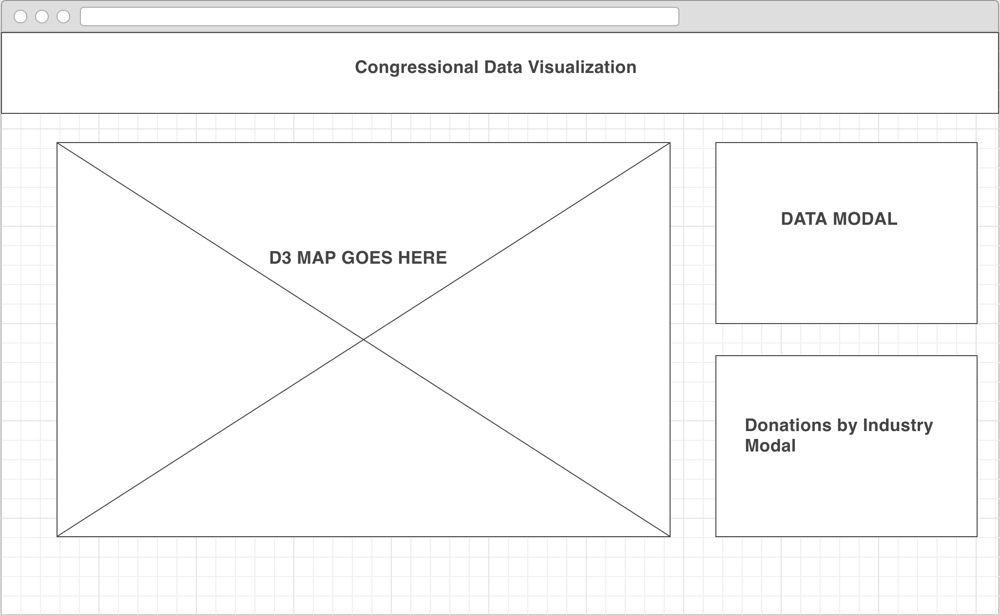

## Senate Donor D3 Visualization

### Understand who the top donors are behind your state’s representatives in Washington DC.

[Click Here to view on Heroku](https://senate-d3-vizualization.herokuapp.com/)

I wish to create an interactive heat map of the United States using D3 JavaScript visualization. Pulling electoral donor data from the Center for Responsive Politics I will pull data on the top major corporate donors for US senators (and major house districts, time permitting).

As the user scrolls across the page, modals will display showing the selected state, its senators, and their top five donors. I will also allow the map to be customized by the user to filter by donor or by industry. As the CRP’s API has a limitation on calls per day, I will be saving the donor data down into a PSQL database to be called.

#### Default:
* View by senate seat by top donor
* View as a heat map by industry

#### Wireframe:

#### Technologies Used:
* HTML
* CSS
* JavaScript
* Express
* Node.js
* PSQL
* D3 JavaScript

#### User Story:
As a user, I wish to better understand how campaign financing varies from state-to-state, and which major corporate and individual donors favor which candidates.

#### Flow:
12/6: Finalize idea, approval & research D3 js

12/7: MVC, begin D3 map build

12/8: Databases & D3

12/9: Complete D3 map build

12/10-12/12: Troubleshooting, bug fixes

12/12-12/14: Styling

#### Blockers:
* Heavy D3 customization beyond simple mapping.
* API call constraints meant I needed to save donor data to an SQL database, left me having to focus on senators instead of all of Congress.

#### Attributions:
* All of Mike Bostock's D3 master [mapping tutorial](https://bost.ocks.org/mike/map/) and [resources](http://bl.ocks.org/mbostock)
* In Particular: [Swiss Cantons & Lakes](http://bl.ocks.org/mbostock/10024231) and [Zoom-Transfer](http://bl.ocks.org/mbostock/2206590)

http://bl.ocks.org/mbostock/10024231

